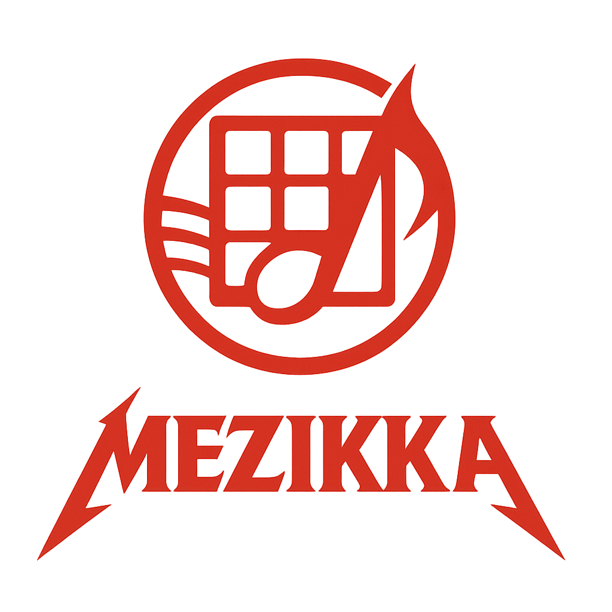
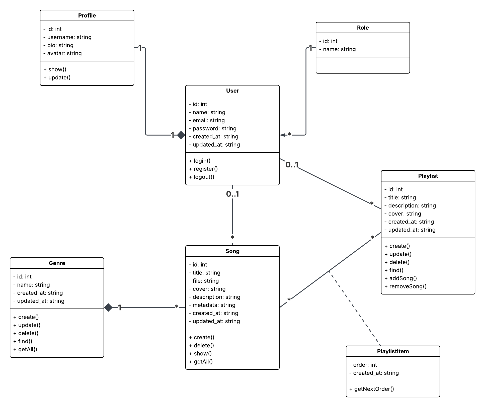
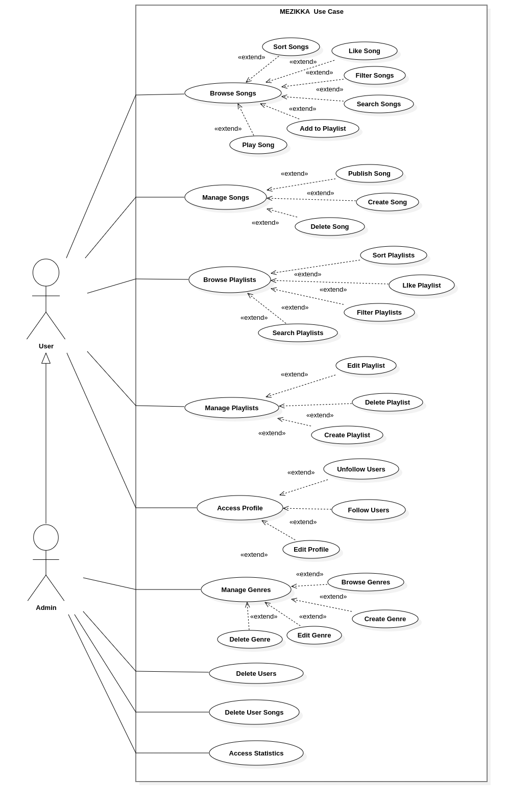

# Mezikka



**Mezikka** is a full-stack music creation and sharing platform where users can produce music directly in the browser, build public playlists, discover new songs by others, and interact through social features such as following, liking, and playlists. Built using modern technologies, Mezikka brings the music production and sharing experience to the web in an intuitive and powerful interface.

---

## Links

[Maquette](https://www.figma.com/design/IKDzDWyTYCZxOX56DyMTni/Untitled?node-id=0-1&t=6ej7F2HelxDlRLUJ-1)
[Scrum Board](https://trello.com/b/3hW5aSwN/mezikka)
[Presentation] (https://www.canva.com/design/DAGmHbc9938/GK8ZENhfETbkaKKO3LU0lg/view?utm_content=DAGmHbc9938&utm_campaign=designshare&utm_medium=link2&utm_source=uniquelinks&utlId=h1458d55eb3)

---

## Table of Contents

- [Features](#features)
  - [User Functionality](#user-functionality)
  - [Admin Functionality](#admin-functionality)
- [Tech Stack](#tech-stack)
  - [Backend](#backend)
  - [Frontend](#frontend)
- [UML](#uml)
  - [Class Diagram](#class-diagram)
  - [Use Case Diagram](#use-case-diagram)
- [Getting Started](#getting-started)
  - [Prerequisites](#prerequisites)
  - [Installation](#installation)
  - [Environment Variables](#environment-variables)
- [Project Structure](#project-structure)
- [Development Guide](#development-guide)

---

## Features

### User Functionality

- **Authentication**
  - JWT-based email/password login and registration
- **User Profiles**
  - Edit username, avatar, and bio
  - View other users' profiles, songs, playlists, followers, and followings
- **Social Features**
  - Follow/unfollow other users
  - Like songs and playlists
  - View liked songs and playlists
- **Music Creation**
  - Use an in-app music creation tool with recording support
  - Assign unique keys to songs for saving and loading music state
  - Upload, and delete songs
- **Playlists**
  - Create public playlists with custom covers and names
  - Edit and delete playlists
- **Music Discovery**
  - Browse songs by genre
  - Search songs by title or creator
- **Listening Experience**
  - Built-in audio player
  - Manage playback queue
  - Track listening history

### Admin Functionality

- View and manage user statistics via admin dashboard
- Create and manage music genres
- Delete user content as needed for moderation

---

## Tech Stack

### Backend

- **Laravel** (RESTful API structure)
- **MySQL/PostgreSQL** (configurable)
- **Docker** (containerization and environment consistency)

### Frontend

- **React** (TypeScript-based)
- **Vite** (build tool for fast performance)
- **TailwindCSS** (utility-first styling)
- **React Router** (client-side routing)
- **Zustand** (local state management)
- **React Query + Axios** (API handling)
- **Tone.js** (music synthesis and playback)
- **Lucide React, MUI, React Icons** (icons & UI components)
- **Framer Motion** (animations and transitions)

---

## UML

### Class Diagram



## Use Case Diagram



## Getting Started

### Prerequisites

Make sure you have the following installed:

- [Docker](https://www.docker.com/)
- [Docker Compose](https://docs.docker.com/compose/)
- [Git](https://git-scm.com/)

### Installation

1. **Clone the Repository**

```bash
git clone https://github.com/tahajaiti/mezikka.git
cd mezikka
```

2. **Start the App with Docker Compose**

```bash
docker-compose up --build -d
```

This will launch both the frontend (React + Vite) and backend (Laravel) containers.

3. **Access the App**

- Frontend: [http://localhost:3000](http://localhost:3000)
- Backend API: [http://localhost:8080/api](http://localhost:8080/api)

---

### Environment Variables

Each part of the stack has its own `.env` file. Make sure to copy the example files and configure them properly:

**Backend**

```bash
cp backend/.env.example backend/.env
```

Then edit `backend/.env` with your database and JWT settings.

**Frontend**

```bash
cp frontend/.env.example frontend/.env
```

Edit `frontend/.env` to set the API URL (usually `http://localhost:8080/api`).

---

## Project Structure

```
mezikka/
├── backend/             # Laravel API backend
├── frontend/            # React + Vite frontend
├── docker-compose.yml   # Main Docker orchestration file
├── README.md            # Project documentation
```

---

## Development Guide

### Backend (Laravel)

- Code is organized with Controllers, Services, and Repositories
- JWT authentication using `tahajaiti/jwt`
- Routes are located in `routes/api.php`
- Uses Laravel Sanctum or JWT for secured endpoints

### Frontend (React)

- Vite dev server runs on port 3000
- API interaction is handled by React Query and Axios
- Local state (playback, session, UI) is managed by Zustand
- Music editing handled with Tone.js
- Component-based structure inside `src/components`
- Routing is configured using React Router DOM

---
